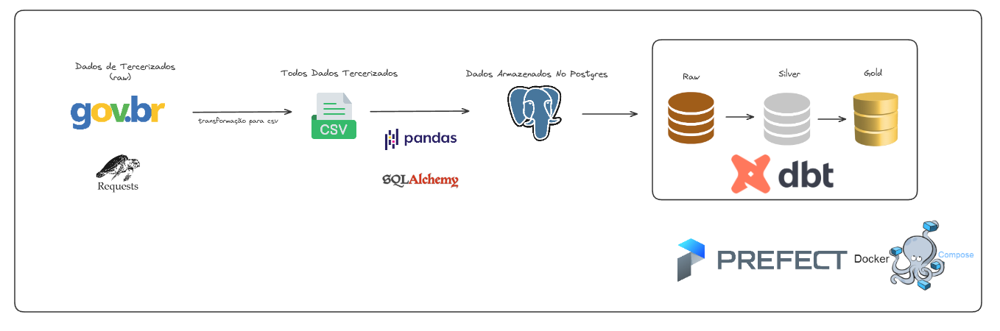

## Data Enginner Dados Tercerizados:

Este projeto tem como objetivo extrair, tratar e armazenar dados de terceirizados disponíveis em [dados abertos do governo](https://www.gov.br/cgu/pt-br/acesso-a-informacao/dados-abertos/arquivos/terceirizados).



A pipeline captura dados do site do governo, que são atualizados quadrimestralmente. Foi utilizado:
- Prefect:  Orquestrador para gerenciar todo o processo da pipeline. Permite monitorar o desempenho dos pipelines e gerenciar tarefas de forma eficiente.
- Docker Comopse: Escalabilidade e segurança do código. (Falta DockerFile do Prefect)
- Python: Pandas e SQLAlchemy.
- DBT: Utilizado para criar views e tabelas derivadas a partir dos dados carregados no PostgreSQL, facilitando a integração com dashboards e outras ferramentas de visualização.


## Estrutura do Projeto

### Extração e Processamento

- **`generate_urls`**: Gera URLs para os arquivos de dados baseados no ano e mês fornecidos.
- **`download_and_process`**: Baixa e processa os arquivos CSV e XLSX a partir das URLs geradas.
- **`save_urls_to_txt`**: Salva as URLs geradas em um arquivo `.txt`.
- **`save_all_csv`**: Salva os dados processados em arquivos CSV.

### Armazenamento

- **`load_dataframes_from_csv`**: Carrega os dados dos arquivos CSV para um DataFrame Final e realiza a junção dos dados.
- **`load_dataframe_to_postgres`**: Carrega o DataFrame para uma tabela no PostgreSQL.

### Transformação

- **`DBT`**: Utilizado para criar views e tabelas derivadas a partir dos dados carregados no PostgreSQL.


### Explicando pouco do código:

Caso o arquivo `urls_tercerizados.txt` não exista, o fluxo "first_run" é acionado para capturar APIs que geraram os arquivos `.csv`. (Há outras maneiras de fazer)

OBS: Já disponibilizamos o arquivo `urls_tercerizados.txt` necessário para a execução.

O flow Extract and Saving as CSV vai extrair os dados de todas as base de dados 

Agora que temos url fazemos requisição via requests tratamos e baixamos em csv na pasta /csv.

Juntamos todo o .CSV e enviamos para Postgres Via SQLAlchesmity.

Com os dados no DB, o qual é inicializado via DockerCompose.

É utilizado DBT para gerar tabelas as quais podem ser consumidas por um DashBoard, por exemplo.


## Melhorias:

Algumas melhorias que podem ser feitas:
- Melhorar tratativas dos dados.
- Coleta de Dados.
- Refatoração de alguns códigos/arquitetura. (ta cm uma camada a mais eu acho)
- Escalabilidade: Docker e Poetry
- Implementar Schedule Quadrimestral/Lógica de ATT do banco.

Nota-se que os dados devem ser atualizados quadrimestralmente. Para isso utilizaremos schedules do Prefect.

 #### Antes de rodar o script no seu computador, certifique-se de ter o seguinte instalado em sua máquina:
* Python 3.10.12
* Docker 26.1.4
* Docker-compose 1.29.2


1. **Clone o repositório:**
   ```bash
   git clone https://github.com/bAlemar/desafio-data-eng

2. **Navegue até o diretório do repositório clonado:**
   ```bash
   cd desafio-data-eng

4. **Inicie o PostgreSQL**
   ```bash
   docker-compose up

4. **Crie ambiente e Instale as depedências**
   ```bash
   python3 -m venv venv
   source venv/bin/activate
   pip install -r requirements.txt

4. **Inicie Prefect Server**
   ```bash
   prefect server start

4. **Inicie os Flows**
   ```bash
   python3 flow.py

**Acessar Prefect Server:**

http://127.0.0.1:4200/ 